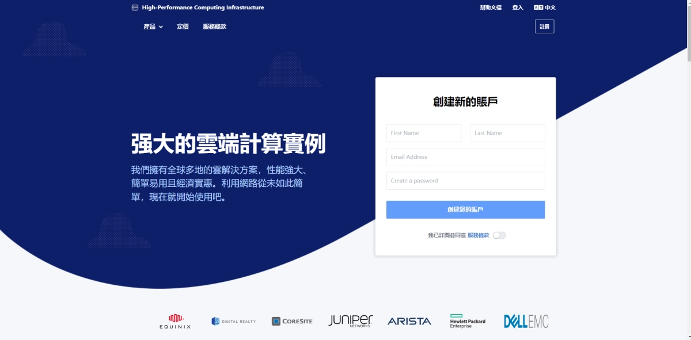

# DMIT VPS主机7折优惠：香港/日本/洛杉矶三地可选，53.83美元起年付

---

如果你正在寻找一个稳定的海外VPS主机用于跨境业务、建站或者数据中转，线路质量和性价比往往是最让人头疼的问题。太便宜的容易丢包，太贵的又超出预算。DMIT这次的7折促销活动，刚好在价格和质量之间找到了一个不错的平衡点——1GB内存起步配置，年付价格最低53.83美元（约合370元人民币），覆盖香港CN2、日本CN2和洛杉矶CN2 GIA等优质线路。对于需要稳定连接亚太地区或者北美市场的用户来说，这个配置和价格组合值得关注。

---

## DMIT是谁？

DMIT是2017年成立的美国主机服务商，主要业务集中在KVM架构的VPS和独立服务器上。他们的机房分布在香港、日本、洛杉矶、圣何塞等地，线路类型包括CN2 GIA、CN2和国际BGP线路。

从实际使用反馈来看，DMIT的服务器配置相对保守但稳定。他们不搞超售那套，所以在高峰期的表现比较稳定。如果你用过一些便宜VPS在晚上8点突然变得巨慢，就知道这种稳定性有多重要了。

## 当前优惠活动

这次DMIT放出了两个优惠码：

**30%折扣优惠码（适用于东京T1线路）**
- 适用产品：TYO.T1.TINY及更高配置
- 适用周期：季付及以上
- 折扣力度：7折优惠
- 使用场景：如果你主要服务日本或者需要日本节点做中转

**20%折扣优惠码：202510_HKG_TYO_PRO_20OFF_RECURRING**
- 适用产品：PRO线路（香港和东京）
- 折扣力度：8折优惠
- 使用场景：预算充足且对线路质量要求更高的用户

需要注意的是，这两个优惠码不能叠加使用。如果你是第一次购买DMIT，建议先从基础的T1线路入手，测试一下实际速度是否符合你的需求。

## 主机配置详情

### T1.WEE（入门年付套餐）

这是最基础的配置，适合轻量级应用或者测试使用：

- CPU：1核心
- 内存：1GB
- 存储：20GB SSD
- 流量：1TB/月（4Gbps端口，上传下载都计算）
- IP地址：1个IPv4
- **价格：36.9美元/年**（约254元人民币）

👉 [如果你想搭建个人博客或者轻量级API服务，这个配置基本够用](https://www.dmit.io/aff.php?aff=13832)

可选机房：
- 香港CN2线路
- 日本CN2线路
- 洛杉矶CN2 GIA线路

### T1.TINY（推荐配置）

这个套餐使用30%优惠码后性价比最高：

- CPU：1核心
- 内存：1GB
- 存储：20GB SSD
- 流量：2TB/月（4Gbps端口，双向计算）
- IP地址：1个IPv4
- **月付：6.9美元**
- **年付：76.9美元**（使用优惠码后约53.83美元）

相比T1.WEE，这个套餐的流量翻倍到2TB，对于中等流量的网站或者应用来说更有余地。如果按年付并使用优惠码，平均每月不到5美元，这个价格在同类型CN2线路VPS中算是中等偏下的。

可选机房：
- 香港CN2线路
- 日本CN2线路
- 洛杉矶CN2 GIA线路

## 线路选择建议

**香港CN2**
- 优势：到大陆延迟最低，通常30-50ms
- 适合：需要频繁访问大陆网络的业务
- 注意：香港带宽成本高，所以同配置价格会稍贵

**日本CN2**
- 优势：延迟适中（50-80ms），线路相对香港更稳定
- 适合：跨境电商、游戏加速、内容分发
- 注意：部分地区晚高峰可能有波动

**洛杉矶CN2 GIA**
- 优势：回国带宽充足，价格相对便宜
- 适合：不太在意延迟但需要大带宽的场景
- 注意：物理距离远，延迟通常在150ms以上

如果你主要服务国内用户，香港是首选。如果预算有限且能接受100ms左右的延迟，洛杉矶CN2 GIA的性价比更高。日本节点则是两者之间的折中选择。

## 实际使用场景

**个人博客或小型网站**
T1.WEE或T1.TINY都够用。1GB内存跑个WordPress加上基础插件没问题，只要访问量不是特别大（日均几千PV以内）。

**跨境电商独立站**
建议至少选T1.TINY，2TB流量能支撑更多的图片和视频加载。如果网站开始有起色，可以随时升级到更高配置。

**API服务或数据中转**
👉 [对于需要频繁与国内服务器通信的API服务来说，DMIT的CN2线路能提供相对稳定的连接质量](https://www.dmit.io/aff.php?aff=13832)。4Gbps的端口速度也能保证数据传输不会卡在带宽上。

**开发测试环境**
如果只是用来测试某些功能或者搭建演示环境，T1.WEE的年付套餐最划算。一年254元，平均每月21块钱，比很多国内的轻量服务器还便宜。

## 需要注意的细节

**流量计算方式**
DMIT的流量是双向计算的，也就是说你上传和下载都会消耗流量配额。如果你的应用需要频繁上传大文件到服务器，要把这部分流量也算进去。

**端口速度**
T1系列的端口速度是4Gbps，理论峰值速度可以达到500MB/s。实际使用中很难跑满这个速度，但至少不会因为端口限制导致速度瓶颈。

**IP地址**
基础套餐只提供1个IPv4地址。如果你需要多个独立IP（比如搭建多个网站或者服务），可能需要额外购买或者选择更高配置的套餐。

**退款政策**
DMIT提供7天无理由退款。如果购买后发现线路不适合你的需求，可以在7天内申请全额退款。这点对于第一次购买的用户来说比较友好。

---

## 总结

DMIT这次的7折优惠活动，对于需要稳定海外VPS的用户来说是个不错的入手时机。T1.TINY套餐使用优惠码后年付53.83美元，配合2TB流量和CN2线路，在同价位产品中算是性价比较高的选择。如果你正好需要一个稳定的香港、日本或洛杉矶节点，可以考虑趁这次活动入手测试一下。当然，最好还是先从月付开始，确认线路质量符合预期后再考虑年付。毕竟适合别人的不一定适合你，实际测试永远比看别人的评测更靠谱。
